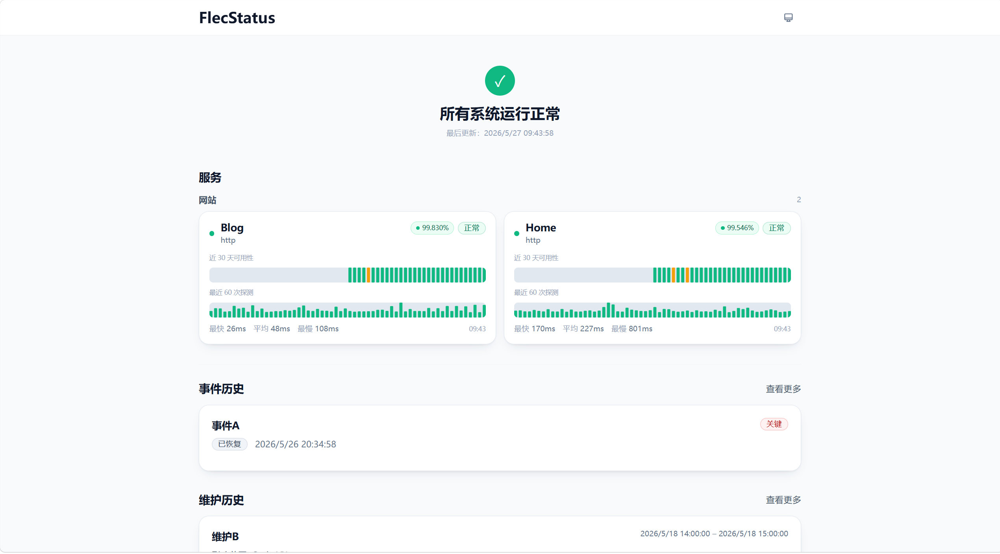

<div align="center">
  

  <h1>FlecStatus</h1>

  <p>
    一个轻量、实用的服务状态监控系统。
  </p>

  <p>
    基于 <a href="https://github.com/VrianCao/Uptimer">Uptimer</a> 二次开发，
    保持简洁，补全缺失的能力。
  </p>

  <p>
    <a href="https://status.flec.top">在线预览</a> /
    <a href="https://github.com/talen8/FlecStatus/issues/new">问题反馈</a> /
    <a href="https://qm.qq.com/q/Zzm9XN6lOi">社群交流</a>
  </p>

  <p>
    
    
    
    
  </p>
</div>

<p align="center">
  
</p>

## 关于

FlecStatus 是一个基于 Cloudflare Workers 和 D1 构建的服务状态监控系统，衍生自 [Uptimer](https://github.com/VrianCao/Uptimer)。

原项目提供了干净的核心框架：HTTP/TCP 端点监控、事件与维护管理、公共状态页和管理面板。FlecStatus 在此基础上做了功能取舍和体验优化，以适应不同的生产部署习惯。

**核心能力**

- HTTP/HTTPS/TCP 端点监控与状态判定（含自定义断言）
- 30 天可用率统计与日粒度时间线
- 事件（Incident）生命周期管理
- 维护窗口（Maintenance Window）管理
- Webhook 告警通知
- 公共状态页（支持 SEO / SSR 预渲染快照）
- 管理员面板（监控、事件、维护、通知、设置）
- 管理端接入 Cloudflare Zero Trust 鉴权
- 数据分析面板（概览统计、单监控项分析）
- 多语言支持（英文、简体中文、繁体中文）

## 技术栈

### Backend — Cloudflare Workers

- **运行时**: Cloudflare Workers
- **框架**: [Hono](https://hono.dev)
- **数据库**: [D1](https://developers.cloudflare.com/d1) + [Drizzle ORM](https://orm.drizzle.team)
- **验证**: Zod
- **调度**: Cron Triggers + Lease Guard
- **缓存**: Cloudflare Cache API

### Frontend — Vue 3 SPA

- **框架**: [Vue 3](https://vuejs.org)
- **构建**: [Vite](https://vitejs.dev)
- **路由**: Vue Router
- **状态**: Pinia + TanStack Vue Query
- **样式**: SCSS

## 快速部署

**前置准备**

Fork 本仓库到你的 Github 账号里

**创建 D1**

进入 [Cloudflare 仪表盘](https://dash.cloudflare.com/) → 存储与数据 → D1 SQLite 数据库 → 创建数据库，名称填写 `flecstatus-d1`。

**创建 Worker**

连接仓库到 Cloudflare，构建设置：

| 配置项 | 值 |
|--------|-----|
| **生产分支** | `main` |
| **构建命令** | `npm install` |
| **部署命令** | `npm run deploy` |

**连接数据库**

打开 Worker 绑定页面，添加一个 D1 数据库绑定，变量名称填写 `DB`，数据库选择前面创建的。

**配置管理员认证**

管理后台使用 [Cloudflare Zero Trust](https://developers.cloudflare.com/cloudflare-one/) 保护：

1. Zero Trust → 访问控制 → 应用程序 → 新建应用程序
2. 选择 **自托管和私有**，域名填你的 Worker 域名，路径 `/admin`
3. 配置允许访问的邮箱域名或用户

**验证**

- 公共状态页：`/`
- 管理后台：`/admin`（如配置了 Access 则需认证）

**自定义域名**

在 Worker → 域 中添加。

## 目录结构

```
FlecStatus/
├── src/                    # Worker 后端源码
│   ├── db/                 # Drizzle 表定义与数据库工具
│   ├── monitor/            # 监控探测逻辑（HTTP/TCP/状态机）
│   ├── notify/             # Webhook 通知
│   ├── routes/             # API 路由处理器
│   ├── scheduler/          # Cron 定时调度（检查/统计/清理）
│   ├── snapshots/          # 公共页快照系统（分片组装）
│   ├── index.ts            # Worker 入口
│   ├── fetch-handler.ts    # 请求路由（热路径优化）
│   └── hono-app.ts         # Hono 应用配置
├── web/                    # Vue 3 前端
│   ├── src/
│   │   ├── pages/          # 页面组件
│   │   ├── components/     # UI 与业务组件
│   │   ├── api/            # API 客户端与类型定义
│   │   ├── i18n/           # 多语言翻译
│   │   └── styles/         # SCSS 全局样式
│   └── index.html
├── wrangler.toml           # Cloudflare Workers 配置
└── package.json
```

## 许可证

本项目基于 [MIT License](LICENSE) 开源。

## 致谢

- [Uptimer](https://github.com/VrianCao/Uptimer) — 本项目的基础，感谢 VrianCao 的开源工作
- [Cloudflare Workers](https://workers.cloudflare.com) — 提供边缘计算与 D1 数据库
- 所有贡献者和使用者

## 联系方式

- Issues: [GitHub Issues](https://github.com/talen8/FlecStatus/issues)
- Email: [talen2004@163.com](mailto:talen2004@163.com)
